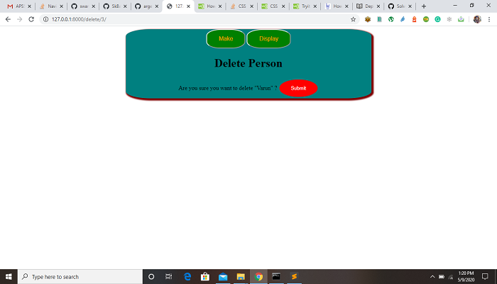

# Django - CRUD Operations

## Requirements
```
Django==2.0.2
Python 3.4.2
```
## Run the project
```
$ python manage.py makemigrations app

$ python manage.py migrate

$ python manage.py runserver
```
## To Home Data into Data Base


## To Make Data into Data Base


## To Display Data into Data Base


## To Update Data into Data Base


## To Delete Data into Data Base



